## Análisis de recurrencia por canal de pago y categoría de cliente para clientes con créditos en Frávega.

#### Advanced Analytics

#### Noviembre de 2023

# Definición de tipos de clientes

## Clientes presenciales, virtuales y mixtos

Para determinar el canal al cual pertenece un cliente, se analiza el o los canales en los que dicho cliente realizó cada pago de su crédito durante el mes bajo análisis y los 24 meses previos. Si solo realizó pagos en tiendas físicas en ese período, se considera un cliente exclusivo de Tiendas Físicas o **presencial**; si efectuó pagos únicamente por medios virtuales, se le clasifica como cliente exclusivo de pagos **virtuales**. Si realizó pagos tanto en tiendas físicas como por medios virtuales, se le considera **mixto**.

## Recurrencia y segmentos de recurrencia para categorizar a los clientes

La recurrencia se define como el tiempo entre las compras realizadas por los clientes. En este contexto, la recurrencia de un cliente que paga su crédito en un mes determinado se refiere al lapso entre el pago de la cuota actual y la compra anterior inmediata. Según los días/meses entre estas fechas, se categoriza al cliente en los siguientes rangos de recurrencia:

- **Categoría 0-3 meses** (0-90 días)
- **Categoría 3-6 meses** (90-180 días)
- **Categoría 6-12 meses** (180-365 días)
- **Categoría 12-24 meses** (365-730 días)
- **Categoría Inactivo:** Más de 730 días sin actividad
- Si la primer compra del cliente, fue en el mes bajo análisis, se le clasifica como **Nuevo**.

Ejemplo1: Si un cliente pagó su cuota en enero de 2023, y la compra anterior fue en diciembre de 2022, se clasifica como "0-3 meses" debido a la distancia temporal inferior a los 3 meses entre ambos pagos.

Ejemplo2:  
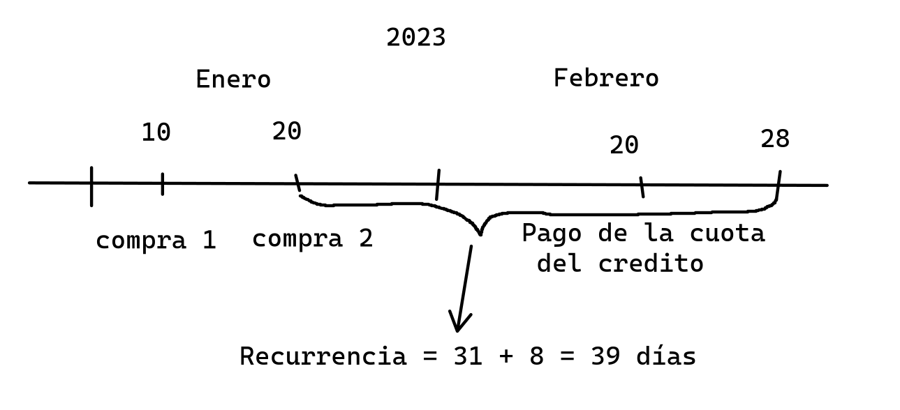

## Frecuencia

La frecuencia se define como la cantidad de compras distintas realizadas por cada cliente en un período de tiempo determinado. Para este proyecto, se cuentan los comprobantes distintos de cada cliente entre el final del mes de pago de la cuota del crédito y los 23 meses anteriores a esa fecha, totalizando 24 meses. La frecuencia se calcula sumando los comprobantes distintos por cliente entre el mes en análisis y los 23 meses anteriores, solo para el conjunto de clientes que pagaron la cuota de su crédito en ese mes. Luego, se obtiene el promedio para todos los clientes, dividiendo entre 2 para obtener la frecuencia anual1.

1\. Se realiza un análisis además para el caso en que en lugar de dividir por 2 un periodo total de 24 meses, se consideren solamente un total de 12 meses.

* * *

## Esquema de trabajo de los datos

### Armado de la base de créditos

Esta base permitirá obtener dos datos importantes: el canal de pago y la fecha de pago. Llamémosla **CREDITOS**.

Esta consulta se enfoca en extraer información específica de la tabla `FT_COBRO_CREDITOS_NEW` en la base de datos `EDW`. La explicación detallada es la siguiente:

- **Selección de Columnas:**  
    La consulta elige ciertas columnas de la tabla, incluyendo `tipo_cobro_sk`, `cliente_sk`, `fecha_cobro_sk`, `NRO_CREDITO`, `NRO_COMPROBANTE`, `cuota_afectada` y `fecha_creacion`.
    
- **Condiciones de Filtrado:**  
    Se aplican condiciones para filtrar los resultados:
    
    - Solo se incluyen filas donde el valor de `TIPO_COBRO_SK` sea 21, 23 o 4. (21 y 4 son Tiendas Físicas, 23 medios virtuales)
    - Se excluyen filas donde el valor de `cliente_sk` sea -1 o -2.
    - Se incluyen solo las filas donde `fecha_cobro_sk` esté en el rango del 01 de enero de 2022 al 31 de octubre de 2023.  
        Esta base se uso para un análisis previo, es nuestro caso en particular solo nos importan los clientes del 2023.
- **Ordenamiento de Resultados:**  
    Los resultados se ordenan en función de varias columnas en orden ascendente:
    
    - Primero, por `cliente_sk`.
    - Luego, por `nro_credito`.
    - Después, por `NRO_CREDITO`.
    - Además, por `NRO_COMPROBANTE`.
    - Finalmente, por `cuota_afectada`.

El propósito de esta tabla es obtener la base de clientes según su tipo y fecha de creación, información relevante para determinar la categoría del cliente, especialmente si es nuevo.

### Armado de la base de ventas

Esta consulta se centra en la tabla `MV_FT_VENTAS_MIX_LIBRE` de la base de datos `EDW`, llamada **ventas**, con la siguiente descripción detallada:

- **Selección de Columnas:**  
    La consulta elige las siguientes columnas de la tabla: `CLIENTE_SK`, `FECHA_VENTA`, `NRO_COMPROBANTE`, `ORDER_ID`, `precio_facturado`, `unidades` y `importe_fact_sin_iva`.
    
- **Condiciones de Filtrado:**
    
    - Selecciona solo las filas donde el valor de `CLIENTE_SK` esté en un conjunto obtenido de otra consulta.
    - Además, se incluyen solo las filas donde `fecha_venta` esté en el rango del 01 de enero de 2021 al 31 de octubre de 2023.
- **Ordenamiento de Resultados:**  
    Los resultados se ordenan por `FECHA_VENTA` en orden ascendente.
    

En términos generales, el objetivo de este conjunto de datos es obtener las ventas para cada tipo de cliente, según los tipos y categorías definidos previamente.

* * *

## Cálculo de frecuencia y recurrencia por canal y categoría de usuario.

Pasos comunes para ambos casos:

1.  Partiendo de la base **créditos**, se realiza un preprocesado de los datos.
2.  Se obtienen de la base de créditos los usuarios que fueron a pagar su crédito para cada mes.

### Frecuencia

Para el cálculo de la frecuencia, se utiliza la base **ventas**, la cual se filtra según lo descrito previamente en la definición de frecuencia. Esta base se filtra tomando como referencia el último día del mes bajo análisis y los 24 meses previos para cada grupo obtenido en el paso anterior. De esta manera, se obtiene una frecuencia desglosada por grupos mensuales para el año 2023. Luego, se realiza una nueva desagregación para calcular las frecuencias para cada canal, promediando las frecuencias de cada grupo de clientes por canal y por mes.

Aquí se presenta un ejemplo de la frecuencia mensual promedio discriminada por su medio de pago:

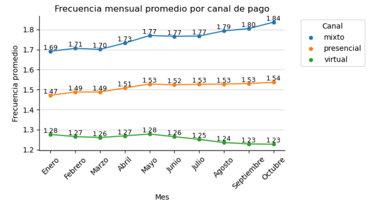

&nbsp;

Si además consideramos lo expresado previamente, calculando la frecuencia solo para un periodo total de 12 meses, en lugar de calcular para un periodo de 24 y dividir por 2, el resultado será el siguiente:

### 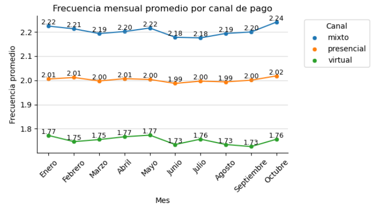

### Recurrencia

Sobre la base de clientes de cada mes, se calcula la cantidad de días transcurridos desde el pago de la cuota hasta la compra anterior para cada usuario del mes. Estos datos se separan según su canal de pago, como se define en la recurrencia. A partir de esta segmentación, se realiza un conteo de cuántos clientes caen dentro de cada canal de pago y para cada mes.

Aquí se muestra un ejemplo para un mes:

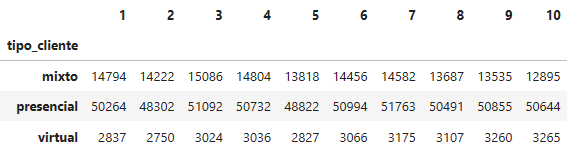

Esta información se puede interpretar fácilmente a través de gráficos, como se muestra a continuación:

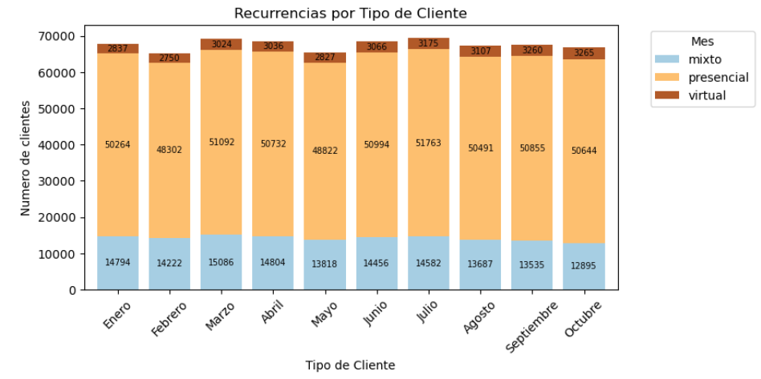

O también mostrando las proporciones respecto del total mensual:

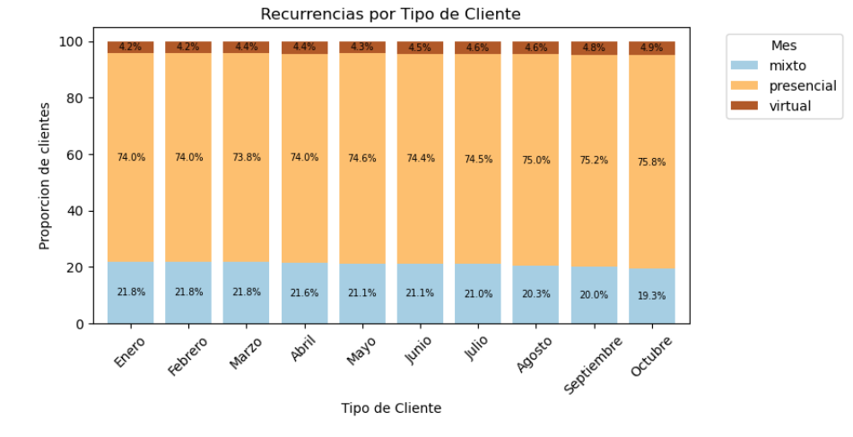

Si se realiza una desagregación por categoría, se puede obtener una tabla donde el índice del mes comienza en 0 para enero:

En ella se aprecia la cantidad de personas que caen dentro de cada tipo y categoría para los meses de enero y febrero.

Estos datos se pueden presentar de forma condensada en un gráfico:

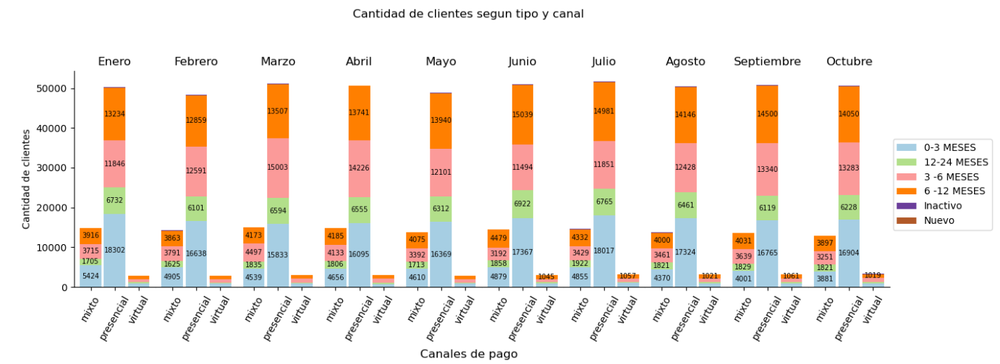

También se puede presentar en proporciones respecto del total de cada canal:

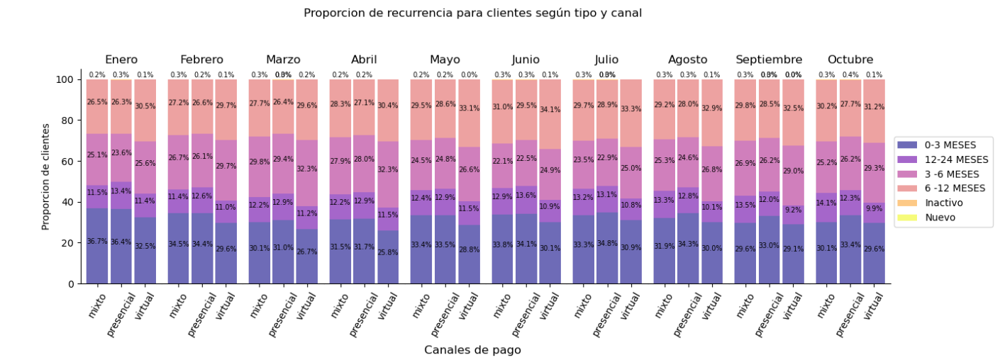

Además, para hacer los gráficos más interpretables, se pueden separar según el canal de pago:

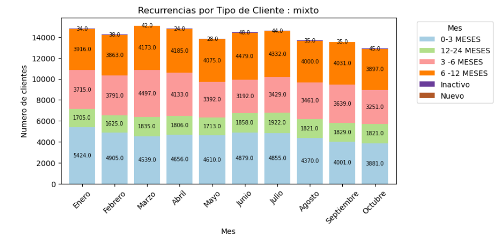

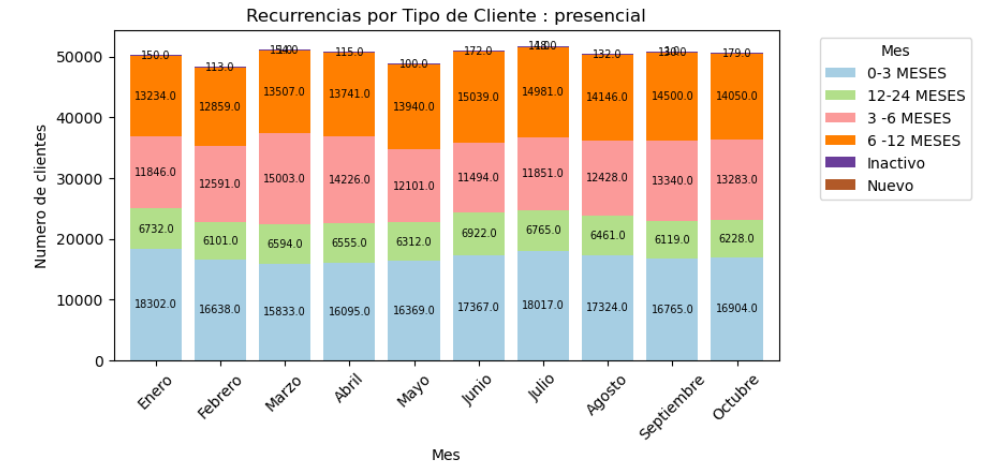

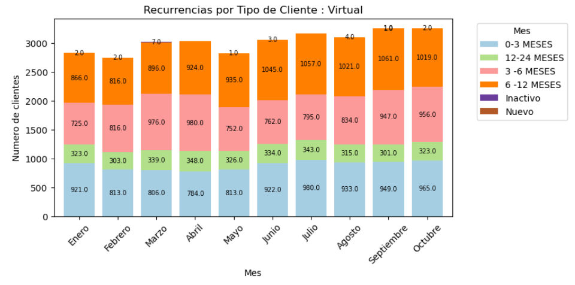

Así como también observarlos en proporciones respecto del total de cada mes:

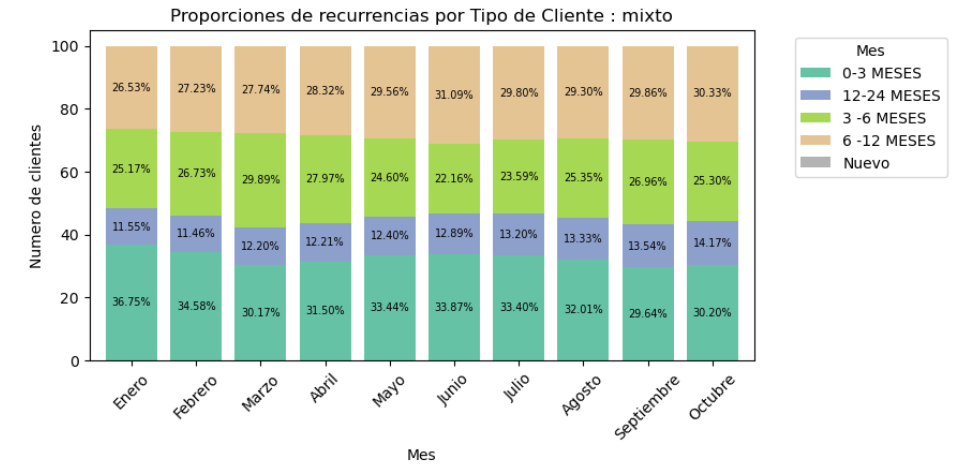

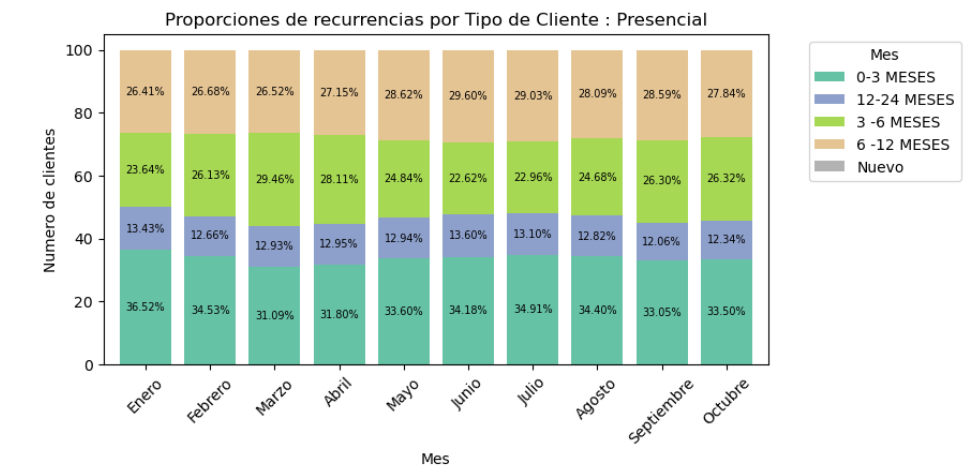

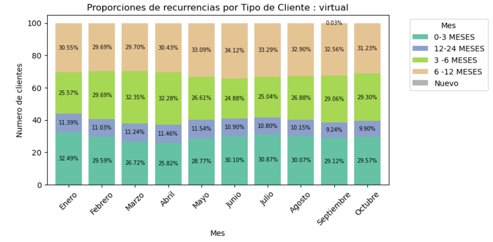

## Validaciones: Como sabemos que esto se realiza de manera correcta.

1.  **Veamos si los rangos de fechas se toman de manera adecuada**:
    
    Esto lo podemos hacer tomando a modo de ejemplo uno de los subsets de datos que se utilizan para cada mes. Si consideramos el mes de enero
    
    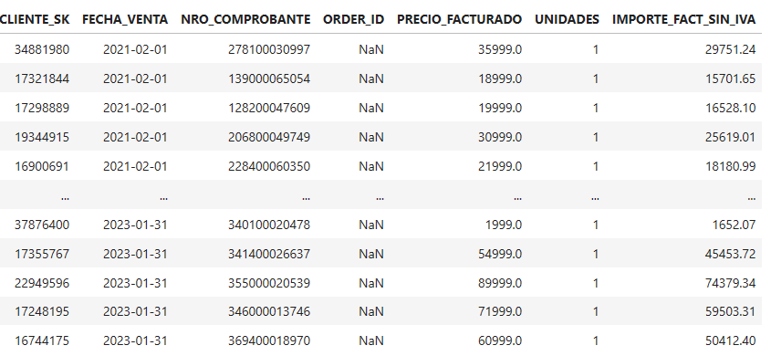  
    *Podemos apreciar que las fechas (que están ordenadas) computan 2 años en total.*
    
2.  \*\*Veamos si los comprobantes únicos se toman de manera adecuada:\*\*La siguiente imagen es una captura de el set de datos agrupados por usuario y cantidad de comprobantes:  
                                                      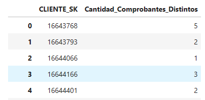
    
    Consideremos al primer cliente y verifiquemos en nuestra base de datos si este trabajo se realizo de manera adecuada:  
                                                                 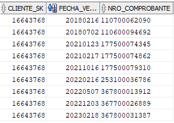  
    Podemos observar que si consideramos las fechas bajo análisis (1 de Febrero de 2021 al 31 de Enero de 2023)  
    El cliente tiene 5 comprobantes distintos, pero ¿Fue a pagar su crédito en enero del 2023?  
                                                                   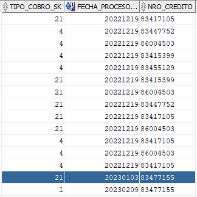  
    Vemos que efectivamente el 3 de enero fue a pagar su crédito (marcado en azul) y que además lo por ventanilla (Sucursal - `TIPO_DE_COBRO = 21`).  
    Por otro lado, es fácilmente apreciable al tener `TIPO_DE_COBRO = 21` y `TIPO_DE_COBRO = 21`  El cliente es del tipo mixto
    

Repitamos este procedimiento una vez mas para eliminar toda duda:  
Ahora el mes bajo análisis sera octubre-2023

1.  **Verificamos las fechas**:  
    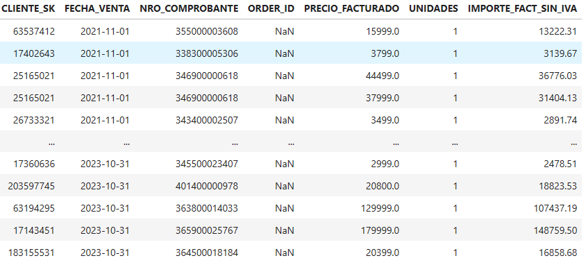
    
2.  **Veamos si los comprobantes únicos se toman de manera adecuada:  
                                               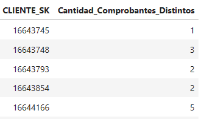  
    Consideremos el ultimo cliente:  
                                                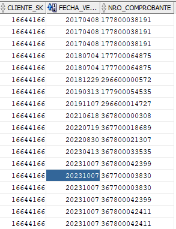**                                                                                                                                                                                desde la fecha limite inferior 2021-11-01 realizo 9 compras, pero con comprobantes únicos solamente 5
    
    ## ==**Con esta información puesto que funciono para estos casos particulares y el proceso se repite de manera análoga para todos los usuarios, podemos concluir que sobre todos se obtendrán la cantidad de comprobantes adecuada.**==
    
3.  Finalmente el tomar la ultima fecha para contar los días de la recurrencia y calcular sus promedios o incluso calcular los promedios de las frecuencias es un proceso que no reviste mayor complejidad por lo que se omite, pero se comenta adecuadamente en el codigo.
    

&nbsp;