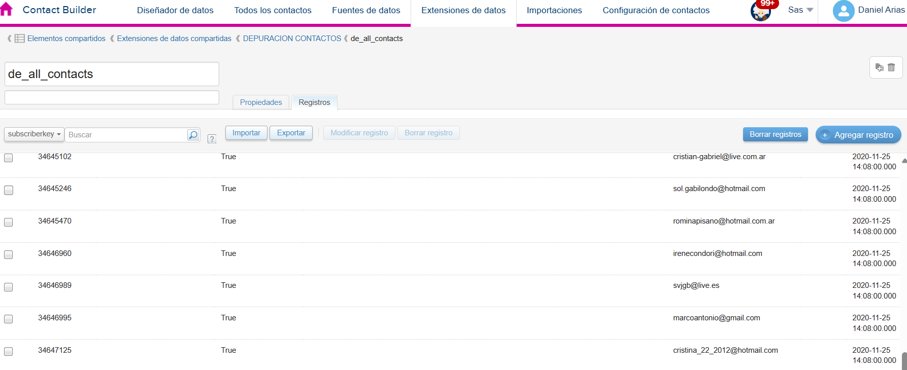

Necesitamos hacer una limpieza de emails

1.  De donde sacamos los datos.
2.  Si modificamos de alguna base en particular, se modificaría información en la otra o son procesos independientes?
3.  De donde toma los datos?
4.  Salesforce puede levantar las audiencias si las tiro en una base de SQL de oracle?
5.  Como puedo lidiar con el limite de los 20 mb al descargar una base en sf

&nbsp;

&nbsp;

