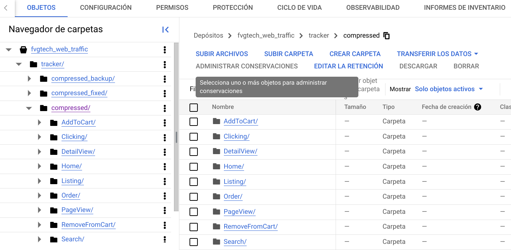
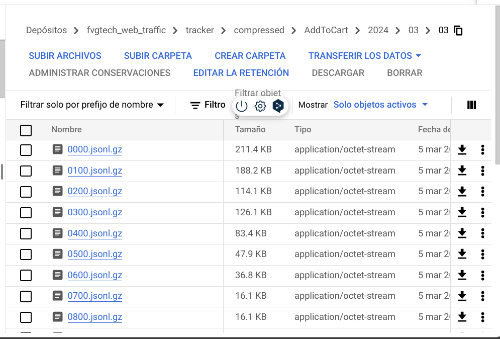

# Data funnel web

12/04/2024
## Objetivo

El objetivo de el funnel es representar de manera cómoda y detallada información sobre el comportamiento web de los clientes en la página de Frávega haciendo uso del tracker diseñado exclusivamente para ese uso, para esto daremos una explicacion una explicación general sobre como se obtiene y procesa la data que finalmente es depositada en **BigQuery** para ser levantada y graficada en un cubo **Microstrategy**. 


## Introducción tracker

El tracker web fue un desarrollo de del equipo de Julian Alonso, el cual levanta data de la web de Frávega y se encarga de enviarla a una serie de buckets en [Cloud Storage](https://console.cloud.google.com/storage/browser/fvgtech_web_traffic/tracker/staged;tab=objects?hl=es&prefix=&forceOnObjectsSortingFiltering=false&authuser=0). Estos buckets contienen distintas etapas de la data, ya sea la data en tiempo real, la data en estado staged y la que se utilizó particularmente en esta version, la data a dia cerrado que recibe el nombre de compressed (dado que se encuentra comprimida), veamos un ejemplo de la jerarquia:



Es necesario dar una breve introducción sobre dichos eventos:

* PageView: Es el evento que captura las urls de entrada y de salida asi como la metadata de la pagina como el dispositivo del cual se conecto el cliente, si llego de una campaña de marketing, etc. 
* DetailView: Este evento corresponde solamente al acto de observar un producto en particular, captura información como el producto que se esta observando, su precio, codigo de articulo,etc.
* AddToCart: Registra el acto de agregar un producto al carrito.
* RemoveFromCart: Registra  la eliminación de un producto del mismo.
* Order: Registra las ordenes de compra. Posee la particularidad de que si una compra se llega a caer, no registra la caida de esa compra, por lo que si bien posee ese detalle, es una cantidad muy pequeña.
* El resto de los eventos, si bien hay algunos importantes como listig, no fueron utilizados de momento.


Cada una de las carpetas en compressed corresponde a alguno de los eventos previamente comentados y dentro de ellas se encuentran los archivos comprimidos para cada dia y para cada horario en intervalos de 1 hora veamos un ejemplo de esto:


## Toma de los datos

Dada la jerarquida en la que tracker guarda los datos, se creo una libreria llamada `data_extraction`, la cual desde una notebook de **Vertex AI** se conecta a dicho bucket y levanta para un intervalo de tiempo arbitrario, la data de un set arbitrario de eventos, veamos un ejemplo de su uso:

``` python
# # Ejemplo de uso:
project_id = 'fvgtech-prd-analytics'
gcs_bucket = 'fvgtech_web_traffic'
start_date = datetime(2024, 3, 11)
end_date = datetime(2024, 3, 15)
eventos = ['PageView', 'DetailView','AddToCart','RemoveFromCart']  # Lista de eventos a procesar

blob_processor = BlobProcessor(project_id, gcs_bucket)
df = blob_processor.process_blobs(start_date, end_date, eventos)
display(df.head(),df.shape)
```
Dicha libreria busca obtener de manera arbitraria un subset relevante para el analisis de toda la informacion disponible en tracker los componentes principales de dicho subset son, para cada evento:
- PageView
  - session_id
  - cookie_id
  - referrer
  - base_url
  - original_url
  - ingestionTimestamp
  - clientTimestamp
  - utm_medium
  - utm_campaign
- DetailView
  - device
  - event_type
  - price
  - cod_articulo
  - geoAvailability_Availability
  - homeDelivery_Availability
  - homeDelivery_label
  - categorization
- AddToCart
  - Solo se trae la data para contar cuantos eventos hubo para cada session_id
- RemoveFromCart
  - Solo se trae la data para contar cuantos eventos hubo para cada session_id
- Orders:
  - Solo se trae la data para contar cuantas ordenes hubieron  para cada session_id. 

## Procesado de los datos

A partir de la data generada a con el data extractor se obtiene un dataframe con las columnas previamente comentadas. Sobre ellas se realizan una serie de pasos de preprocesado que se comentarán a continuación:

- **Filtrado de bots**: Para tener información lo mas precisa posible sobre  el tráfico real del sitio web, se implemento lo comentado en etapas anteriores en los siguientes 2 items:
  - **Filtrado de device=Spider**: En general  las visitas realizadas por spiders no son relevantes para el análisis del comportamiento, ya que suele ser el user agent de los bots. Teniendo esto en mente se filtraron las observaciones provenientes de ese dispositivo.
  - **Filtrado de sesiones con muchas acciones**: En muchos casos, sucedio que habia sesiones extremadamente largas que dificilmente provengan de un comportamiento real de busqueda. Por este motivo se realizó un filtrado automatico de las sesiones que estan mas allá del percentil 0.999. 
- **Conversion de las variables temporales**: A las variables temporales que de tracker son tomadas como un timestamp con UTC0, se las llevo a formato fecha con GMT-3 hora Argetina. 
- **Corrección a los datos debido a un problema del tracker**
  - **Eventos duplicados**: Durante la investigación, se descubrio que habian observaciones duplicadas en ciertas ocaciones determinadas en el evento PageView. Se halló una manera de sanear puntualmente dicho problema, recurriendo a los tiempos entre eventos para asumir que eran duplicados. Posteriormente se translado el problema a las personas encargadas del tracker por lo que actualmente se encuentra solucionado. Si bien a partir de la fecha de solución el problema quedo solucionado en tracker, la corrección debe permanecer en el codigo para todas las observaciones previas.
  - **Sesiones activas por demasiado tiempo**: Idealmente el tiempo maximo en que una sesión debe permanecer activa sin actividad es media hora, sin embargo esto no siempre ocurria adecuadamente, por este motivo se renombraron como nuevas sesiones (junto a todas las acciones posteriores) a todas aquellas en las que la diferencia entre alguno de los eventos sea mayor o igual a media hora. Con esto, los tiempos entre eventos pasaron a ser los intuitivamente esperados.

- **Parseo de referral**: A todas las url referral se las parseo de manera de ser facilmente comprensibles, ya sea desde el punto de vista de los dominios de origen, como Google o Instagram, asi como tambien los dominios internos de la web como los productos, o los listados. La lista final es la siguiente:
  - Producto
  - Landing
  - Home
  - Listing
  - Carrito
  - Checkout
  - Mi Cuenta
  - Login
  - Order
  - Comparar
  - Facebook
  - Instagram
  - Google
  - Bing
  - YouTube
  - Yahoo
  - Otro (engloba al resto de las url que escapan de las anteriores)
- **Parseo de base_url**: A todos los base_url se los parseo de una manera análoga a la de los `referral` de manera que la lista final fue:
  - Home
  - Listing
  - Carrito
  - Checkout
  - Producto
  - Order
  - Landing
  - Mi Cuenta
  - Payment
  - Email
  - Shipping
  - Login
  - Otro (engloba al resto de las url que escapan de las anteriores)

### Descripción general de la generación de la tabla:

En aspectos generales podemos, sin perder generalidad decir que la generacion de la tabla final se rige por los siguientes items:

1. **Cálculo de métricas temporales**: Se calcula el tiempo promedio y total de eventos para cada índice, lo cual proporciona información valiosa sobre el comportamiento temporal de los usuarios en el sitio web.

2. **Agrupación de cookies por sesión**: Se agrupan las cookies por sesión para facilitar el seguimiento del comportamiento de los usuarios a lo largo de su interacción con el sitio.

3. **Conteo de pageviews por sesión**: Se cuenta el número total de pageviews por sesión, lo que ayuda a entender la actividad general de los usuarios en el sitio.

4. **Creación de columnas de orden**: Se agrega una columna que representa el orden dentro de cada grupo, lo que permite entender la secuencia de eventos para cada sesión de usuario.

5. **Selección de pasos iniciales**: Se seleccionan solo los primeros 'pasos' elementos de cada grupo, lo que limita el análisis a los primeros pasos del funnel web.

6. **Pivotaje de datos**: Utiliza la función `unstack()` para pivotar la tabla y convertir los valores de 'orden' en columnas, lo que facilita el análisis posterior de los eventos.

7. **Renombrado de columnas**: Se renombran las columnas de manera significativa y se agrega una columna con el flag de valor nulo, lo que mejora la legibilidad y la comprensión del DataFrame resultante.

8. **Concatenación de columnas de 'step'**: Se concatenan las columnas de 'step' para facilitar el análisis de la secuencia de eventos para cada sesión de usuario.

9. **Creación de indicadores binarios**: Se iteran sobre los eventos únicos y se crean columnas de indicadores binarios para verificar la presencia de cada evento en las etapas de navegación, lo que permite identificar patrones de comportamiento específicos.

10. **Cálculo de tiempos promedios y totales**: Se calculan los tiempos promedios y totales de eventos, considerando solo aquellos eventos distintos de cero, lo que proporciona información sobre la eficiencia y la duración de cada etapa del funnel web.

11. **Agregación de información adicional**: Se agrega información adicional, como la fecha de inicio de la sesión, el número de eventos de diferentes tipos y características de los usuarios, lo que enriquece el análisis del funnel web.

12. **Imputación de valores faltantes**: Se realizan imputaciones de valores faltantes si es necesario, lo que garantiza la integridad de los datos y la fiabilidad del análisis.

13. **Modificación de nombres de columnas**: Se modifican los nombres de las columnas para hacerlos más descriptivos y claros, lo que facilita la interpretación de los resultados del análisis.

14. **Retorno del DataFrame transformado**: Finalmente, se devuelve el DataFrame transformado, listo para su uso en el análisis del funnel web.

Este proceso proporciona una base sólida para entender el comportamiento de los usuarios en el sitio web y optimizar el funnel web para mejorar la conversión y la experiencia del usuario. En la siguiente sección se hará una descriptiva de las columnas finales del dataset.


## Mapeo de columas de salida

Al dia de la fecha, el dataset de salida cuenta con 111 columnas, antes de ver sus definiciones, repasemos las acciones [^aclaracion_evento] que vamos a considerar:

- Producto
- Listing
- Login
- Carrito
- Home
- Otro
- Shipping
- Mi Cuenta
- Email
- Payment
- Order


[^aclaracion_evento]: Se habla de acciones dado que usar **eventos** podria considerarse un abuso de notación, ya que eventos en si son aquellos que recolecta el tracker web. Sin embargo, es posible que se utilicen ambos casos, los cuales en su contexto son igualmente correctos. 


A partir de éstas, en su mayoría obtenias de parsear las columnas `referrer` y `base_rl`,
se generó el set de columnas finales, Éstas seran explicadas de acuerdo a su grupo de pertenencia. 

### Conjunto 1: Información del usuario

En este grupo tenemos la información perteneciente al usuario, en ella, los `session_id` y los `cookie_id`  son claves únicas para identificar ya sea la cookie del usuario, como su sesión (la cual expira a la media hora de no registrarse actividad).
La única falencia de momento de esta clasificación es que no podemos saber si distintas cookies  son del mismo usuario o no lo son, ya que puede a priori conectarse de distintos dispositivos con distintas cookie_id. Dichas columnas son:

- **navigation_step_session_id** : Id de sesión del usuario.
- **cookie_id**: Id de tracker del usuario (se obtiene a partir de una cookie en el navegador web). 

### Conjunto 2: Sesiones y Pasos de Navegación

En cada una de estas columnas tendremos de manera ordenada, el camino que fue desarrollado el usuario en el sitio web de frávega. En el primer paso tendremos el lugar al que aterrizo el cliente, dicho lugar es generado a partir de la data procesada de `base_url` transformada en las "acciones" o "eventos" comentados previamente. Un detalle de suma importancia a destacar es que no se obtienen todos los pasos, sino un subconjunto de los primeros 15 pasos. 

- **Pasoi** : Contiene el paso correspondiente dentro de la navegacion del usuario, i es un indice que va entre 1 y 15. Por ejemplo, un usuario en el Paso1 puede llegar a un **Listing**  y posteriormente en el Paso2 ir a un **Producto**. En el caso en que en el paso i-esimo, el cliente no haya registrado actividad, se reemplazará el Nulo con un `""` (un string vacio).
- **Sesiones_Pasoi**: Son todas las columnas con valores de i identicos a los pasos (del 1 al 15), que registran si en el paso i hubo actividad, en caso de que la haya colocan un 1, caso contrario un 0.
- **Pasos_Totales** : *Consultar con Ari* Registra la cantidad de pasos dentro del set de 15 pasos que  se tiene definido para representar la actividad web. No es el total pero sirve a modo indicativo. (Viene heredado de las primeras versiones)

### Conjunto 3: Conversiones y Sesiones por Acción

- **convirtio** : Es un flag que indica si el cliente realizo una orden dentro de la sesion en cuestión.
- **Sesiones_en_ACCIÓN** : En el caso de acción, tendremos una sesiones_en_  por cada accion, por ejemplo, sesiones_en_Producto. En este caso indica si el usuario pasó en algún momento por el evento en cuestión, para el ejemplo, si el usuario paso por Producto, la columna tendrá un 1, caso contrario un 0. 


Remanentes a ver:
- user_in_Landing
- user_landing_in_Landing


### Conjunto 4: Sesiones por Landing Page

- **Sesiones_Landing_ACCIÓN** : Tendremos una sesion landing por cada accion, por ejemplo, Sesiones_Landing_Producto, en este caso es un entero que en caso de que la sesion haya aterrizado en Producto, tendrá 1, caso contrario 0. 

### Conjunto 5: Sesiones por Rebote

- **Sesiones_Rebote_ACCIÓN**: En este caso, para cada una de las acciones en el primer paso, se mira si en el siguiente paso hubo o no una acción (si la persona abandonó la sesión) en caso de que la haya abandonado, se le pone un 1, caso contrario 0. 


- Landing_purchased

### Conjunto 6: Ordenes por Landing Page

- **Ordenes_Landing_ACCIÓN**: Para cada una de las acciones, si el usuario aterrizó en alguna acción en particular, la columna Ordenes_Landing_ACCIÓN tendra 1 si el usuario realizo una orden y 0 en caso contrario. 

### Conjunto 7: Métricas de Tiempo 


- **fecha** : Fecha en que fue generado el evento
- **Tiempo_Promedio** : Tiempo promedio de la sesion, dado que tracker no monitorea el tiempo de permanencia en cada sitio, lo unico que podemos obtener son los tiempos entre eventos, si el tiempo es cero, indica que el cliente entro y salio, ya que no tuvo un evento posterior con el cual contrastar. 
- **Tiempo_Total**: Suma de los tiempos entre eventos para cada sesión, padece el problema analogo al del item anterior, nuevamente en caso de tener un cero estamos frente a un cliente que rebotó en la primer interacción.


### Conjunto 8:  Páginas Visitadas

- **Paginas_Visitadas**: Total de paginas visitadas para cada `session_id`

- **Paginas_Visitadas_ACCIÓN**: Muestra el total de paginas visitadas abierto por cada una de las acciones en el Paso1, caso contrario 0. 


### Conjunto 6: Otros

- **Cantidad_de_Add_to_Cart**: Para cada una de las sesiones, se busca la cantidad de  eventos`addToCart` que tuvo.
- **Cantidad_de_Remove_to_Cart** : ara cada una de las sesiones, se busca la cantidad de  eventos`removeFromCart` que tuvo.
- **Cantidad_de_Detail_View**:Para cada sesión se cuenta la cantidad de eventos `DetailView` que tuvo el cliente.
- **Cantidad_de_Listados**: Se cuenta la cantidad de listados que miro el cliente para toda la sesión.
- **Precio_Promedio_DetailView**: De todos los `detailView` que hizo el cliente, se releva su precio y se le calcula el promedio, mas claramente; es el promedio de los precios de los productos que el usuario miró.
- Origen_Agrupado
- **Retiro_Inmediato**: A renombrar, contiene la proporción dependiendo de si el usuario vio o no disponible alguno de los productos que vio para su retiro. Si de 3 productos a los que les hizo `detailView`, 2 estaban disponibles, seria 0.66. 
- **Envio_Gratis**: A renombrar, analogo del caso anterior  pero con la disponibilidad de envio a domicilio.
- **Promesa_Entrega**: A renombrar, contiene las labels con el tiempo de entrega estimado dada la ubicación del cliente.
- **Categoria_Ingreso**: Primer categoria observada, en la mayoria de los casos es por donde el cliente entró al sitio web. 
- **Categoria_Frecuente**: De todas las categorias que el cliente miró haciendo `DetailView`, se releva la mas frecuente. 
- **Tipo_Trafico**:  Indica si es trafico orgánico o no.  1 para si 0 para no. 

### Subida a BigQuery


La subida se realiza de manera automatizada, la generación del esquema, con los nombres de las columnas en BigQuery y los tipos de datos se automatizó reduciendo un complejo problema de hacerse manualmente a una opeación de unos pocos microsegundos. En el codigo se disponibilizan 3 celdas claramente separadas:
- Una que genera tanto el dataframe, como la tabla en BigQuery. 
- Otra que borra la tabla (para los casos en los que tenemos datos previos y no se agregaron nuevas columnas, o modifico el esquema general)
- Y finalmente un script de subida de datos. 


Dicha tabla es levantada posteriormente en Microstrategy y todas las metricas y cruces son graficados en un cubo.