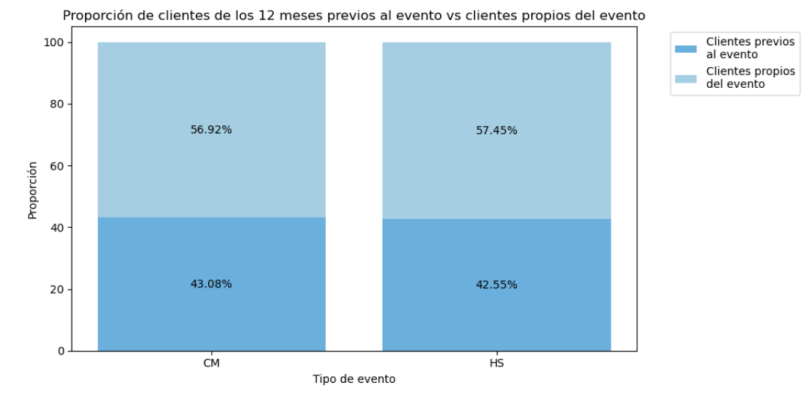
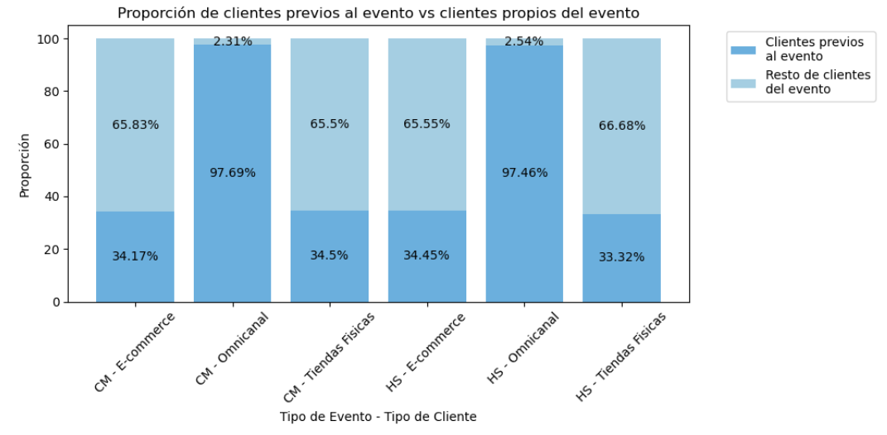
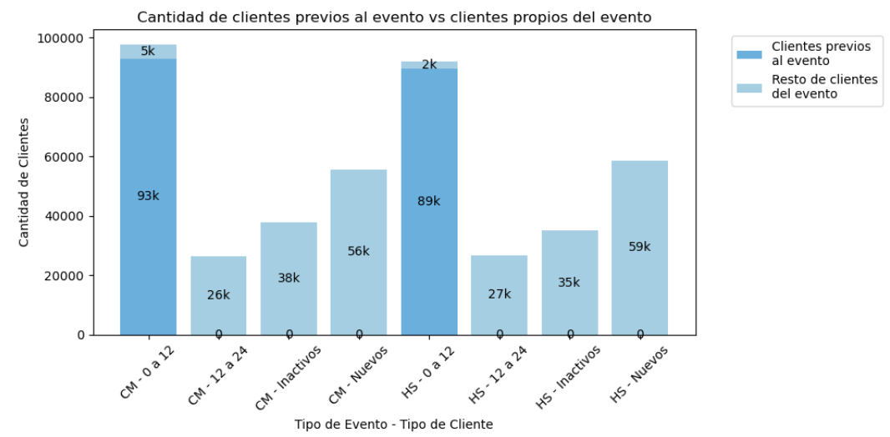
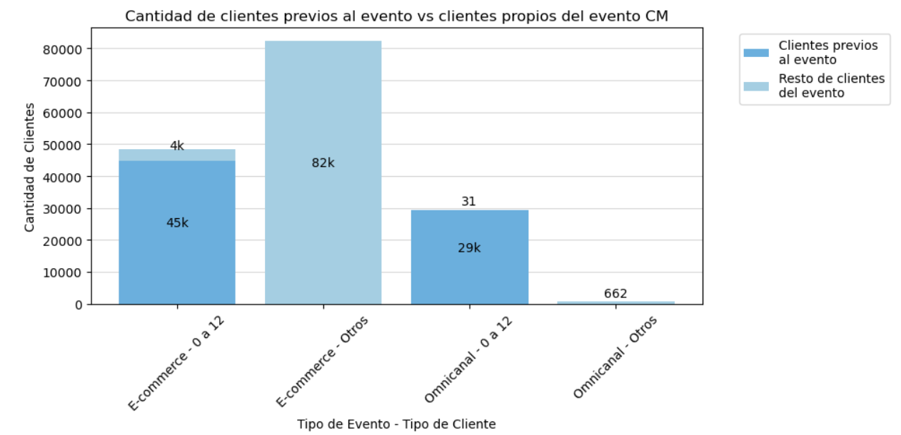
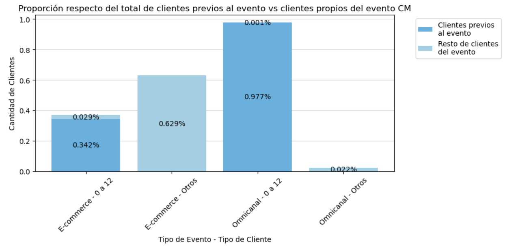
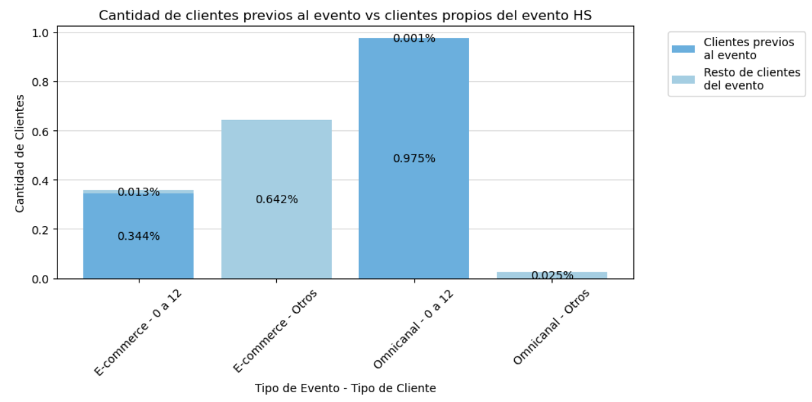

# Cliente omnicanal vs cliente virtual

## Ajuste omnicanal de 12

#### Advanced Analytics

#### Diciembre de 2023

* * *

**Update** 7/12:

Se realizaron grandes cambios respecto de la versión anterior, se reescribieron y repensaron las definiciones de las categorías de Canal de Pago y de Recurrencia.

Se redujo el periodo considerado para calcular el canal de pago de 24 a 12 meses.

* * *

# Definiciones

Para este caso en particular, se adaptaron las definiciones de tipo de cliente por canal de pago y las categorías por recurrencia. Dado que los eventos ocurren a priori separados por varios meses entre si, cada definición se aplica a un grupo en particular que vendrá dado por el evento al que pertenezca, ya sea HS o CM.

Dado que por hipótesis solo consideraremos la base de clientes correspondiente a los 12 meses previos para cada evento y los clientes de los eventos en si.

**Se define**:

## Canal de pago

Para el canal de pago se consideraran 2 años hacia atrás desde el inicio de cada evento. Mas claramente el periodo bajo análisis (1 año) y un año mas en el pasado. Sobre esta base, para cada  evento, se agrupara por canal de pago y:

- Si el cliente compro únicamente en un medio digital, será clasificado como **E-commerce.**
- Si el cliente compro únicamente en tienda, será clasificado como **Tiendas Físicas.**
- Y finalmente, si el cliente compro en ambas será clasificado como **Omnicanal**.

&nbsp;

Sucede que por características propias del problema, habrá clientes que escapen de esta definición, estos serán los del propio evento, ya que ellos quedan excluidos al considerar la base de clientes y 1 año atrás. Para ellos aplicara un concepto análogo, si compraron durante el evento, se les asignara la clasificación de acuerdo a su canal de compra.

&nbsp;

## Recurrencia

En el caso de la recurrencia, es usual calcularla mes a mes. Dado que en nuestro caso el periodo considerado será de un año en total, esta definición se adaptará para nuestro caso en particular, Se determinara sobre la base de clientes previa al evento, la ultima fecha de compra para cada usuario, Luego:

- Si el cliente realizo una compra previa dentro de los 12 meses previo al inicio del evento en cuestión, se le considerará como **0 a 12.**
- De manera análoga, si el cliente realiza una compra previa entre los 12 y los 24 meses previos al inicio del evento, se le considerara como **12 a 24**.
- Si el cliente realizó su ultima compra mas allá de los 24 meses previos, se le considerará como **Inactivos**.

Nuevamente habrán casos que escapen de esta definición y serán aquellos que compren durante el evento. En este caso el plantel de clientes que compra durante el evento estará compuesto por 3 grupos bien definidos.

- Los que compraron previamente al evento. Estos ya tendrán una categoría asignada de las expresadas previamente.
- Los que compraron durante el evento por primera vez. Estos serán clasificados como Nuevos. Esta clasificación se realizara comparando la fecha en la que el cliente compro y se comparara si es igual a la menor de las fechas de compra del cliente. Si esto sucede, el cliente se considerara como **Nuevo**.
- Finalmente habrán casos de clientes que compraron durante el evento, pero cuya ultima compra es menor que las consideradas en el conjunto de datos (mayores al 01-01-2020) para estos, se verificara si su primera compra es antigua (puede ser que un cliente haya comprado hace 4 años por primera vez y realizo una compra durante alguno de los eventos). Estos usuarios serán clasificados como **Inactivos**.

&nbsp;

# Armado de base

Para el caso del Hot-Sale realizaremos una explicación paso a paso:

1.  **Seleccionar datos de ventas:** La consulta extrae datos de la tabla `MV_FT_VENTAS_MIX_LIBRE` del almacén de datos `EDW`.
    
2.  **Filtrar datos:** Los datos se filtran en dos partes:
    
    - La primera parte, `q1`, selecciona ciertos campos de la tabla `MV_FT_VENTAS_MIX_LIBRE` donde se cumplen varias condiciones:
        
        - `CLIENTE_SK` está en un subconjunto de clientes que han realizado ventas dentro de un rango de fechas específico (`FECHA_VENTA` entre el 6 de noviembre de 2022 y el 12 de noviembre de 2023, excluyendo ciertos clientes por su `CLIENTE_SK`).
        - `FECHA_VENTA` está entre el 1 de enero de 2020 y el 12 de noviembre de 2023.
        - `CANAL_SK` está en los valores 1 y 6.
        - `unidades` es mayor que 0.
    - La segunda parte, `q2`, realiza una subconsulta para encontrar la fecha mínima de venta para cada cliente en la tabla `MV_FT_VENTAS_MIX_LIBRE`.
        
3.  **Combinación de resultados:** Los resultados de las dos partes se combinan (`JOIN`) usando `CLIENTE_SK` como clave común. La combinación incluye los campos seleccionados de `q1` y la `fecha_venta_minima` obtenida en `q2`.
    

En resumen, se considerara para la base todas las ventas desde 01-01-2020 hasta la fecha de finalización del evento bajo análisis. El proceso para la obtención de la base de CyberMonday es completamente análogo.

# Resultados

&nbsp;El primer resultado importante fue conocer que tan representativo es el conjunto de personas que compro en el periodo de los 12 meses previos al evento frente al resto de clientes del evento, esta información podemos apreciarla en el siguiente grafico:

En el se aprecia que la base de clientes de ambos eventos es similar, veamos sus proporciones también son similares:

&nbsp;

Notemos que si consideramos el siguiente grafico, lo que podemos apreciar es que los usuarios que vemos en azul, son los usuarios correspondientes a la intersección entre los conjuntos de clientes del evento y los previos a el.  Y el análisis esta centrado en los clientes del evento.

**PONER GRAFICO DE LOS CONJUNTOS**

Por otro lado, si consideramos no solo el evento en si, sino el canal de pago, podemos desagregar estos conjuntos de la siguiente manera, siguiendo un pensamiento análogo al del grafico anterior:

En este grafico, se puede apreciar que si bien los clientes de E-commerce son mas en términos  cuantitativos, al considerar las proporciones que conforman el grafico anterior, podremos apreciar que:

Esto nos lleva claramente a concluir que si bien cuantitativamente la cantidad de clientes E-commerce es mayor en términos de proporción resulta evidente que la cantidad de clientes previos en el caso de omnicanal es mucho mayor que para el resto de los casos.

Otro caso a considerar es a partir de la base de clientes de cada evento en si, que sucede con la categorización de los clientes de acuerdo a la definición previa de recurrencia que generamos. El resultado puede apreciarse en el siguiente grafico:

En este, se puede apreciar que dada la definición de recurrencia en este caso particular, todos los clientes previos al evento (dado que el análisis se realiza sobre una base anual) caen en la categoría de 0 a 12. Por otro lado, para el resto de la base de clientes se puede apreciar que la mayor cantidad viene dada por los clientes nuevos, mientras que si consideramos los clientes de 12 a 24 y los inactivos es importante notar que no tienen clientes previos al evento. Esta diferencia puede ser explicada por la definición propia de recurrencia en confluencia con la base de clientes tomada. Esto sucede ya que dado que la base contiene clientes del año previo, no contendrá ni clientes de mas de 1 año ni inactivos.

&nbsp;

Además de dicha apertura, resulta importante notar que todo el conjunto de clientes que no pertenecen a los 0 a 12 meses de recurrencia, podemos agruparlos en otro conjunto llamado otros con el objetivo de simplificar esta información, veamos el resultado para el caso de CiberMonday:

Si analizamos cual es la representatividad porcentual para cada caso, respecto del total ya sea en E-commerce como en Omnicanal tenemos que:

* * *

Finalmente para el caso del HotSale:

## Simplificación de los graficos:

Si queremos realizar una presentación mas simple de los resultados, podemos quitar la barra de otros que es poco relevante en los cuatro gráficos anteriores. 

## CM

&nbsp;

&nbsp;

## HS

&nbsp;

&nbsp;

